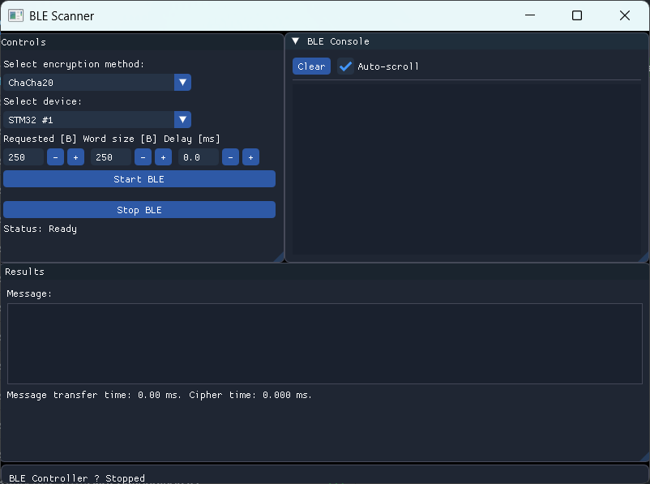

# BLE Scanner with ImGui (English)

Elegant, modular C++ application for scanning and connecting to a BLE device, sending a ChaCha20/ChaCha20-Poly1305/AES-GCM 256 request, decrypting the response and displaying everything in an ImGui GUI. Computing complex statistics from the transmission.

Paired application to the application for STM32WB: https://github.com/xvlach/BleSTM32WB.git

---

## 🚀 Project Overview

This tool will:
1. **Scan** for a single BLE device (by MAC address).  
2. **Connect** over GATT to your custom “P2P” service (FE40).  
3. **Send** either a ChaCha20, ChaCha20-Poly1305, or AES-GCM request.  
4. **Receive** a notification, measure the round-trip time (RTT).  
5. **Decrypt** the payload with your chosen algorithm.  
6. **Log** every step into an ImGui “console”.  
7. **Accumulate** all decrypted bytes into a scrolling “Results” box.  
8. **Expose** an ImGui control panel to pick:  
   * Encryption method (ChaCha20 vs. ChaCha20-Poly1305 vs. AES-GCM)  
   * Target device (from a small hard-coded list) 
   * Transsmision setings 
   * Start/Stop scanning  
9. **After** connecting, enumerate and log all service characteristics (UUIDs & properties), display measured time and statistics.  
10. **Modular** C++/WinRT + mbedTLS + ImGui + GLFW + CMake architecture.

---

## 📂 Project Structure

```
BleScanner/
├── CMakeLists.txt
├── Libs/
│   ├── mbedtls-3.6.0/
│   ├── glfw/
│   └── imgui/
└── src/
    ├── constants.h         ← all KEY, NONCE, UUIDs, device & protocol lists
    ├── util.h/.cpp         ← ConsoleHandler, GuidToString, SetupStyle (ImGui style)
    ├── console.h/.cpp      ← SimpleConsole widget + streambuf adapters
    ├── crypto.h/.cpp       ← CryptoEngine: ChaCha20 / ChaCha20-Poly1305 wrapper
    ├── ble_manager.h/.cpp  ← BleManager: scan, connect, notify, callbacks
    ├── gui.h/.cpp          ← renderControls, renderResults, renderStatusBar
    └── main.cpp            ← initializes WinRT, GLFW, ImGui; wires everything & loop
```

---

## 🔧 Dependencies

- **C++20**  
- **CMake ≥ 3.29**  
- **MSVC** (Windows SDK, C++/WinRT)  
- **mbedTLS 3.6.0**  
- **GLFW**  
- **Dear ImGui**  
- **OpenGL** (via `opengl32.lib`)  

---

## 🛠️ Building in CLion

1. Open CLion and import the project.  
2. CLion will load the CMake configuration (if it doesn't happen automatically, manual run "Reload CMake Project").  
3. Build the project and run the executable.  

---

## 🛠️ Build Instructions

1. Clone the repo:  
   ```bash
   git clone https://github.com/xvlach/BLE_PC.git
   cd BleScanner
   ```
2. Configure & generate:  
   ```bash
   mkdir build && cd build
   cmake .. -G "Visual Studio 17 2022"
   ```
3. Build:  
   ```bash
   cmake --build . --config Release
   ```
4. Run:  
   - `Release/BleScanner.exe`

---

## 🎮 Usage

1. **Launch** the app. A window with three panels appears:
   - **Controls**: choose device & protocol, configuratin, then Start/Stop.
   - **Results**: rolling display of all decrypted bytes.
   - **BLE Console**: internal logs (scanning, connect, notifications, decrypt logs).
2. **Select** the encryption method (ChaCha20, ChaCha20-Poly1305, AES-GCM 256 HW).  
3. **Pick** your target from the device list.
4. **Set** your config data and time parameters. 
5. **Click** **Start BLE**.  
   - The console will show “Scanning…”, advertisements, “Connected…”, etc.  
   - Every notification logs RTT and decrypted text.  
   - **Results** box accumulates the full message.  
6. **Click** **Stop BLE** to disconnect and return to “Ready”. Compute statistics and display in console.

**Note**

If we want to change the primary method of time measurement, it can be done in the "constants.h" file using the "meastureAllTime" variable. The default method of time measurement is used for pure data transfer, without any connection overhead.

---

## 🧩 How It Works

- **constants.h**  
  - Central place for symmetric keys, nonces, all GATT UUIDs, device & protocol lists, time meassure setting.
  - `REQUEST_LIST` now includes:  
    ```cpp
    { "ChaCha20", 0x01 },
    { "ChaCha20-Poly1305", 0x02 },
    { "AES-GCM", 0x03 }
    ```
- **util.h/.cpp**  
  - `ConsoleHandler`: handle CTRL+C to exit cleanly.  
  - `GuidToString`: format GATT UUIDs for logging.  
  - `SetupStyle`: set dark theme + rounding for ImGui.
- **console.h/.cpp**  
  - `SimpleConsole`: ImGui child window + custom `std::ostream` → ImGui logging.  
  - Automatically scrolls, clear button, toggle.
- **crypto.h/.cpp**  
  - `CryptoEngine`:  
    - `init(requestType)` sets up ChaCha-Poly or AES-GCM context on demand.  
    - `decrypt(packet, outMs)` runs the correct algorithm, measures time.
- **ble_manager.h/.cpp**  
 - Encapsulates all WinRT BluetoothLE functionality:  
    - `startScan(address, requestType)`: spawns a thread, checks `Radio`, starts `BluetoothLEAdvertisementWatcher`.  
    - On match, stops watcher, calls `connectToDevice()` → fetches via `GetCharacteristicsAsync()`, and then logs each characteristic’s UUID and property bitmask to the console.  
    - `enableDataNotifications()`: subscribes to FE44, captures RTT & raw packet → `_dataCb`.  
    - `sendDataToDevice()`: writes request byte to FE43, starts timer.  
    - Callbacks:  
      - `onLog(string)`  
      - `onStateChanged(AppState)`  
      - `onData(vector<uint8_t>, double)` 
- **gui.h/.cpp**  
  - Pure ImGui code:  
    - **Controls** window: two `BeginCombo`, three imput collumns, two buttons, state text.  
    - **Results** window: `TextWrapped`, child region.  
    - **StatusBar**: small bar anchored bottom.  
- **main.cpp**  
  - Initialize WinRT & console handler.  
  - Init GLFW, ImGui, apply `SetupStyle()`.  
  - Instantiate `SimpleConsole`, `GuiState`, `CryptoEngine`, `BleManager`.  
  - Hook up `ble.onLog → console`, `ble.onStateChanged → GuiState`,  
    `ble.onData → console + crypto.decrypt + GuiState accumulation`.  
  - Render loop: `renderControls`, `renderResults`, `console.Draw`, `renderStatusBar`.  
  - Clean up on exit.

---

## ✍️ Extending

- **New GATT services/characteristics**:  
  - Add their UUID to `constants.h`.   
  - Expose new “Subscribe” or “Write” methods in `BleManager`.  
  - Add matching UI in `gui.cpp`.
- **Additional encryption**:  
  - Extend `constants.h::REQUEST_LIST`.  
  - Handle the new code path in `CryptoEngine::decrypt`.
- **Cross-platform**: move BLE logic behind an interface, implement per-OS.

---

## 🖼️ GUI
<p align="center">

</p>

---

## 📝 Contact

If you need assistance, feel free to reach out: [xvlach23@vutbr.cz](mailto\:xvlach23@vutbr.cz)

---

# BleScanner s ImGui (Česky)

Elegantní, modulární C++ aplikace pro vyhledávání a připojení k BLE zařízení, odesílání ChaCha20/ChaCha20-Poly1305/AES-GCM 256 požadavku, dešifrování odpovědi a vykreslení v ImGui GUI. Počítání komplexních statistic z přenosu. 

Párová aplikace k aplikaci pro STM32WB: https://github.com/xvlach/BleSTM32WB.git

---

## 🚀 Přehled projektu

Tento nástroj provádí následující kroky:

1. **Prohledá** okolí a vyhledá jedno konkrétní BLE zařízení (podle MAC adresy).  
2. **Připojí se** přes GATT k vlastní službě „P2P“ (FE40).  
3. **Odešle** požadavek zašifrovaný pomocí ChaCha20, ChaCha20-Poly1305 nebo AES-GCM.  
4. **Přijme** notifikaci a změří dobu zpáteční komunikace (RTT – Round Trip Time).  
5. **Dešifruje** přijatá data vybraným algoritmem.  
6. **Zaznamená** každý krok do konzole postavené na ImGui.  
7. **Shromažďuje** všechny dešifrované bajty do posuvného boxu „Výsledky“.  
8. **Zobrazí** ovládací panel (pomocí ImGui), kde lze vybrat:  
   * Šifrovací metodu (ChaCha20, ChaCha20-Poly1305 nebo AES-GCM)  
   * Cílové zařízení (z pevně daného seznamu)  
   * Nastavení přenosu  
   * Spustit/zastavit skenování  
9. **Po připojení** provede výpis všech charakteristik služby (UUID a vlastnosti), zobrazí naměřené časy a statistiky.  
10. **Modulární architektura**: C++/WinRT + mbedTLS + ImGui + GLFW + CMake.

---

## 📂 Struktura projektu

```
BleScanner/
├── CMakeLists.txt
├── Libs/
│   ├── mbedtls-3.6.0/
│   ├── glfw/
│   └── imgui/
└── src/
    ├── constants.h         
    ├── util.h/.cpp         
    ├── console.h/.cpp      
    ├── crypto.h/.cpp       
    ├── ble_manager.h/.cpp  
    ├── gui.h/.cpp          
    └── main.cpp            
```

---

## 🔧 Závislosti

- C++20  
- CMake ≥ 3.29  
- CLion  
- MSVC + Windows SDK (C++/WinRT)  
- mbedTLS 3.6.0  
- GLFW  
- Dear ImGui  
- OpenGL (`opengl32.lib`)  

---

## 🛠️ Build v CLion

1. Otevři Clion a iportuj projekt 
2. CLion načte CMake (pokud se to nestane automaticky, manualně spustit "Reload CMake Project")  
3. Build, Run 

---

## 🛠️ Návod ke sestavení

1. Naklonujte repozitář:  
   ```bash
   git clone https://github.com/xvlach/BLE_PC.git
   cd BleScanner
   ```
2. Nakonfigurujte a vygenerujte soubory:  
   ```bash
   mkdir build && cd build
   cmake .. -G "Visual Studio 17 2022"
   ```
3. Sestavte projekt:  
   ```bash
   cmake --build . --config Release
   ```
4. Spuštění:  
   - `Release/BleScanner.exe`

---

## 🎮 Použití
1. **Spusťte** aplikaci. Otevře se okno se třemi panely:
   * **Ovládání**: výběr zařízení a protokolu, konfigurace, poté Start/Stop.
   * **Výsledky**: průběžné zobrazení všech dešifrovaných bajtů.
   * **BLE konzole**: interní logy (skenování, připojení, notifikace, dešifrovací logy).
2. **Zvolte** šifrovací metodu (ChaCha20, ChaCha20-Poly1305, AES-GCM 256 HW).
3. **Vyberte** cílové zařízení ze seznamu.
4. **Nastavte** konfigurační data a časové parametry.
5. **Klikněte** na **Start BLE**.
   * Konzole zobrazí „Scanning…“, inzerci zařízení, „Connected…“ atd.
   * Každá notifikace loguje RTT a dešifrovaný text.
   * Pole **Výsledky** postupně sbírá celou zprávu.
6. **Klikněte** na **Stop BLE** pro odpojení a návrat do stavu „Ready“. Statistiky se vypočítají a zobrazí v konzoli.

**Poznámka**

Pokud chceme změnit základní metodu měření času, je to možné provést v rámci souboru "constants.h" a proměnné "meastureAllTime", základní metoda měření času probíhá pro čistý přenost dat, bez režije pro spojení.

---

## 🧩 Jak to funguje

- **constants.h**  
  - Centrální místo pro symetrické klíče, nonce, všechny GATT UUID, seznamy zařízení a protokolů.  
  - `REQUEST_LIST` nyní obsahuje:  
    ```cpp
    { "ChaCha20", 0x01 },
    { "ChaCha20-Poly1305", 0x02 },
    { "AES-GCM", 0x03 }
    ```
- **util.h/.cpp**  
  - `ConsoleHandler`: zpracování CTRL+C pro čisté ukončení aplikace.  
  - `GuidToString`: formátování GATT UUID pro logování.  
  - `SetupStyle`: nastavení tmavého tématu a zaoblených rohů pro ImGui.  
- **console.h/.cpp**  
  - `SimpleConsole`: ImGui child okno + vlastní `std::ostream` → logování v ImGui.  
  - Automatické scrollování, tlačítko pro vyčištění výstupu a přepínač viditelnosti.  
- **crypto.h/.cpp**  
  - `CryptoEngine`:  
    - `init(requestType)`: podle potřeby nastaví ChaCha-Poly nebo AES-GCM kontext.  
    - `decrypt(packet, outMs)`: spustí odpovídající algoritmus a změří dobu dešifrování.  
- **ble_manager.h/.cpp**  
  - Zapouzdřuje veškerou WinRT BluetoothLE funkcionalitu:  
    - `startScan(address, requestType)`: spustí vlákno, zkontroluje `Radio`, spustí `BluetoothLEAdvertisementWatcher`.  
    - Po nalezení zařízení zastaví watcher, zavolá `connectToDevice()`, načte charakteristiky přes `GetCharacteristicsAsync()` a poté zaloguje každé UUID charakteristiky a její bitovou masku vlastností do konzole.  
    - `enableDataNotifications()`: přihlásí se k notifikacím FE44, zachytí RTT a surové pakety → `_dataCb`.  
    - `sendDataToDevice()`: zapíše požadavek do FE43 a spustí časovač.  
    - Callbacky:  
      - `onLog(string)`  
      - `onStateChanged(AppState)`  
      - `onData(vector<uint8_t>, double)`  
- **gui.h/.cpp**  
  - Čistě ImGui kód:  
    - Okno **Controls**: dva `BeginCombo`, tři číselné vstupy, dvě tlačítka, textové pole se stavem.  
    - Okno **Results**: `TextWrapped`, child region pro zobrazení výstupu.  
    - **StatusBar**: úzký panel ukotvený na spodní straně okna.  
- **main.cpp**  
  - Inicializace WinRT a konzolového handleru.  
  - Inicializace GLFW, ImGui a aplikace `SetupStyle()`.  
  - Vytvoření instancí `SimpleConsole`, `GuiState`, `CryptoEngine` a `BleManager`.  
  - Propojení signálů: `ble.onLog → console`, `ble.onStateChanged → GuiState`, `ble.onData → console + crypto.decrypt + akumulace v GuiState`.  
  - Renderovací smyčka: `renderControls`, `renderResults`, `console.Draw`, `renderStatusBar`.  
  - Úklid při ukončení aplikace.  

---

## ✍️ Rozšiřování

- **Nové GATT služby/charakteristiky**:  
  - Přidejte jejich UUID do `constants 
  - Zpřístupněte nové metody “Subscribe” nebo “Write” v `BleManager`.  
  - Přidejte odpovídající UI v `gui.cpp`.  
- **Další šifrování**:  
  - Rozšiřte `constants.h::REQUEST_LIST`.  
  - Ošetřete novou cestu v kódu v `CryptoEngine::decrypt`.  
- **Cross-platform**:  
  - Přesun BLE logiky za rozhraní a implementace pro jiné operační systémy.  

---

## 🖼️ Ukázka GUI
<p align="center">

</p>

---

## 📝 Kontakt

Potřebuješ s něčím pomoc, můžeš mi napsat na: [xvlach23@vutbr.cz](mailto\:xvlach23@vutbr.cz)
